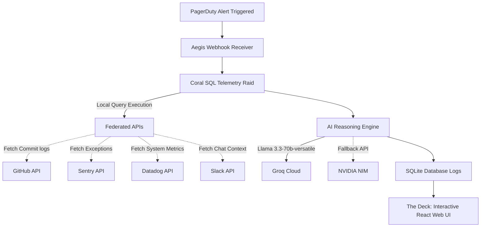

# 🛡️ Aegis: Autonomous SRE Fleet Investigator

> **"Plunder alerts, commits, errors, and metrics in a single raid."**  
> Powered by **Coral SQL**, **Groq Llama 3.3**, and **NVIDIA NIM**.

---

## 🏴‍☠️ The Core Concept (For Non-Technical Folks)

### The "5 Browser Tabs of Doom" Problem
Imagine you run a popular online shop. Suddenly, at 2:00 PM, customers can't check out, and your website starts displaying error messages. 

To fix this, your engineering team (the "crew") has to act like detectives. But the clues are scattered across five different systems:
1. **The Alarm System (PagerDuty):** Screams that the site is broken.
2. **The App Inspector (Sentry):** Logs the exact computer error (like "Database connection lost").
3. **The Server Monitor (Datadog):** Shows performance graphs, like CPU or memory spikes.
4. **The Code Repository (GitHub):** Shows who made changes to the website's code recently.
5. **The Chatroom (Slack):** Where the developers are talking, trying to figure out what happened.

Typically, a human engineer has to open **five different tabs**, compare the timestamps manually, and guess what went wrong: *"Wait, did the alarm go off because John updated the payment code 2 minutes earlier, or was it because the database server ran out of memory?"* 

This guessing game takes time, and every minute the site is down costs money.

---

### How Aegis Solves It
**Aegis** is an automated **AI Detective** (themed like a cyber-pirate crew) that steps in the second an alarm goes off. 

Instead of making humans open 5 tabs and do manual detective work, Aegis:
* **Fires a "Raid":** It uses a tool called **Coral SQL** to treat PagerDuty, Datadog, Sentry, GitHub, and Slack as if they were simple spreadsheets stored locally on the computer. It joins all the data together in a split second.
* **Keeps Data Safe ("Local Waters Only"):** Traditional tools force you to send your passwords, metrics, and secret code to a third-party cloud. Aegis keeps all data local, ensuring your company's secrets never leak to public shores.
* **Brings in the AI Brain (Groq + NVIDIA NIM):** Aegis feeds the consolidated data to a powerful AI brain. The AI analyzes the stack traces, maps the timeline, and finds the exact line of code or setting that broke the app.
* **Delivers the Bounty (The Deck Dashboard):** It presents everything on a single, beautiful screen called **The Deck**. You get a clear summary, the exact culprit (e.g., *"John's commit at 1:58 PM caused this"*), and a recommended fix (e.g., *"Roll back to the previous version"*).

---

## 🏗️ Technical Architecture (Under the Hood)

For the technical crew, here is the blueprint of how Aegis operates:



### Key Technical Pillars:
1. **Coral SQL Layer:** Aegis leverages Coral's query engine to federate data from multiple SaaS sources (PagerDuty, Datadog, Sentry, GitHub, Slack) under a single SQL namespace. Queries are executed locally, allowing cross-source `JOIN`s in memory with zero cloud egress.
2. **AI Analysis Engine:** Integrating **Groq Llama 3.3-70b-versatile** and **NVIDIA NIM**, Aegis automatically interprets raw database outputs, extracts trace logs, isolates code diffs, and computes confidence scores.
3. **The Deck Operations:** A real-time incident dashboard built on React and tRPC, facilitating instant database updates, chat-based querying (converting plain English into Coral SQL), and one-click rollback procedures.

---

## ⚙️ The Technology Stack

Aegis is built with modern, ultra-high-performance technologies:
* **Frontend:**
  * **React & Vite** for rapid rendering and development.
  * **TypeScript** for type safety and code reliability.
  * **GSAP & Framer Motion** for fluid, high-end micro-animations and page transitions.
  * **Tailwind CSS & Shadcn UI** for clean, modern layouts and dark-mode styling.
* **Backend:**
  * **Hono & Node.js** for lightweight, blazing-fast API endpoints.
  * **tRPC** for end-to-end type safety between frontend and backend.
  * **Drizzle ORM & SQLite/PostgreSQL** for storing telemetry configs, incident details, and audit logs.
  * **Supabase** for secure user authentication and session management.

---

## 🚀 Setting Sail (Installation & Setup)

Follow these steps to run Aegis on your local environment.

### 📋 Prerequisites
* **Node.js** v20 or higher.
* **Git** installed on your system.
* **Coral CLI** (optional, mock data will be used if not found).
* API keys for **Groq** and/or **NVIDIA NIM**.
* A **Supabase** project for authentication.

### 1. Clone the Repository
```bash
git clone https://github.com/your-repo/aegis.git
cd aegis/app
```

### 2. Configure Environment Variables
Copy the `.env.example` file and fill in your keys:
```bash
cp .env.example .env
```
Open `.env` and fill in the required fields:
```env
# Database Connection URL (e.g., PostgreSQL or SQLite database)
DATABASE_URL=your_database_url

# Supabase Auth Configuration (Frontend & Backend Keys)
VITE_SUPABASE_URL=your_supabase_url
VITE_SUPABASE_ANON_KEY=your_supabase_anon_key
SUPABASE_SERVICE_ROLE_KEY=your_supabase_service_role_key

# Admin User Setup
OWNER_UNION_ID=your_supabase_user_uuid

# AI Model Configuration
GROQ_API_KEY=your_groq_api_key
NVIDIA_NIM_API_KEY=your_nvidia_nim_api_key
```

### 3. Install Dependencies
```bash
npm install
```

### 4. Setup the Database
Generate and apply database migrations to setup local SQLite or PostgreSQL tables:
```bash
npm run db:push
```

### 5. Launch the App
Run the Vite development server and Hono API server locally:
```bash
npm run dev
```
By default, the server will launch on `http://localhost:5173`. Open this URL in your web browser to enter **The Deck**.

---

## ⚓ The Crew Guidelines
> [!IMPORTANT]  
> **Zero-Downtime Rollbacks:** When triggering a rollback suggestion, Aegis communicates directly with the local Kubernetes deployment manifest. Ensure Kubeconfig settings are mounted if performing this in production.

> [!TIP]  
> **Local-Only Credentials:** Never hardcode auth tokens in your queries. Use standard environment configurations for PagerDuty/Datadog access tokens.

---

## 🛡️ License
Aegis is open-source software licensed under the MIT License.
